<div align="center">
  
  <br/>

# JobGenieAI
### AI Resume & Job Description Analyzer

*An autonomous AI workflow that analyzes your resume against a job description, provides skill gap reports, ATS scoring, and generates an optimized DOCX resume — entirely for free.*

<h3>🌐 <a href="https://jobgenieai.vercel.app/" target="_blank">JobGenieAI Live!</a></h3>


<br/>


</div>

---

## Overview

JobGenieAI is a fully automated AI workflow built on n8n with a custom frontend. It analyzes your resume and a target job description, generating detailed ATS insights, skill gaps, and an instantly downloadable, optimized DOCX resume. 

It is designed to give you enterprise-grade resume screening and optimization, running entirely on free API tiers.

> **Built with reliability and scale at its core** — JobGenieAI features a dual-AI fallback system (Gemini to Groq failover), token-efficient document parsing, and in-browser DOCX reconstruction (via XML and PizZip) to maintain your original resume formatting perfectly.

---

## 📸 Gallery

<div align="center">
  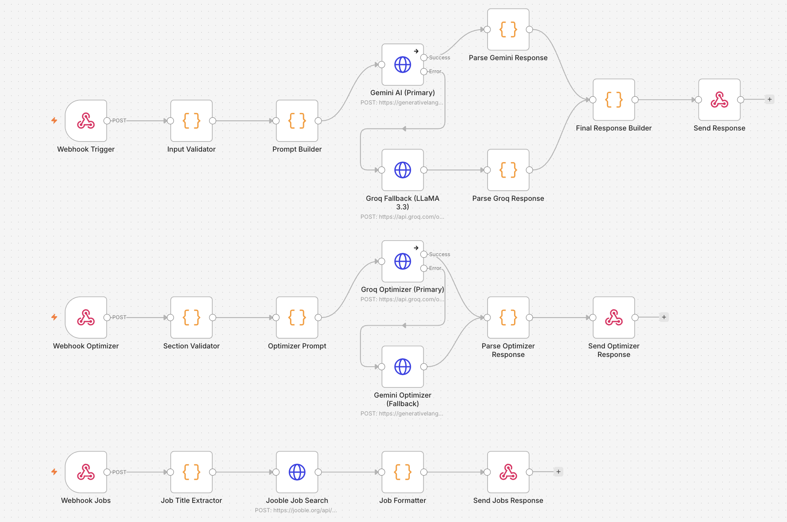
  <br/><br/>
  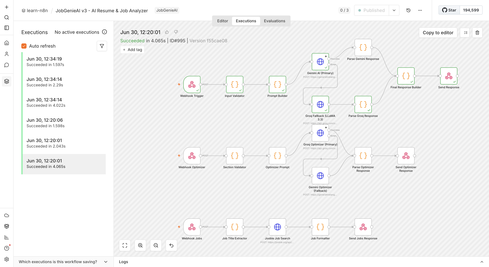
  <br/><br/>
  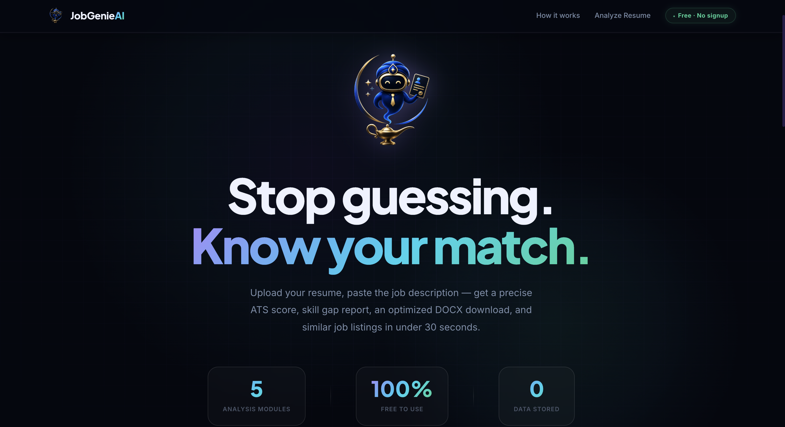
  <br/><br/>
  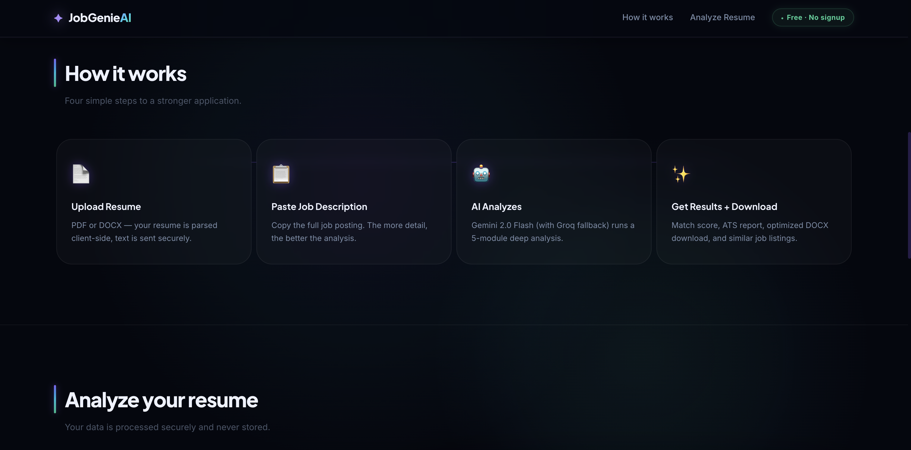
  <br/><br/>
  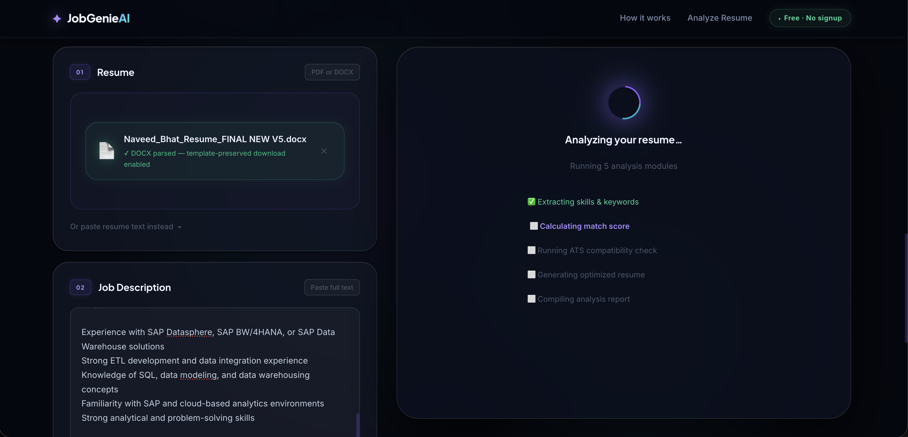
  <br/><br/>
  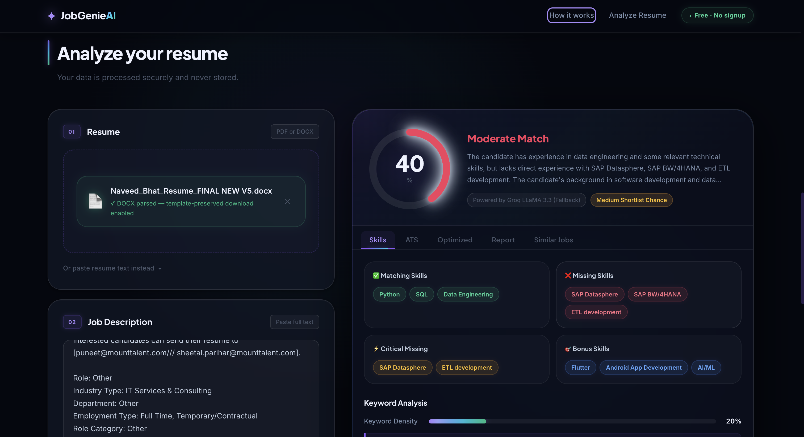
  <br/><br/>
  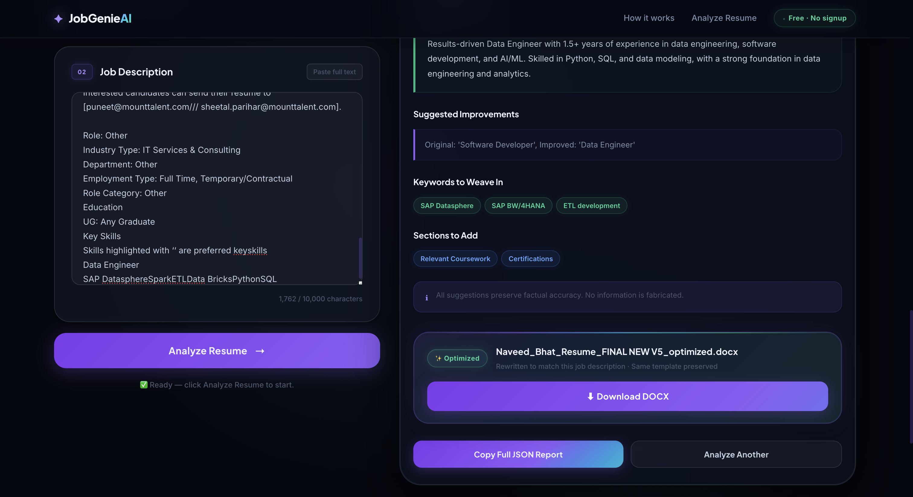
  <br/><br/>
  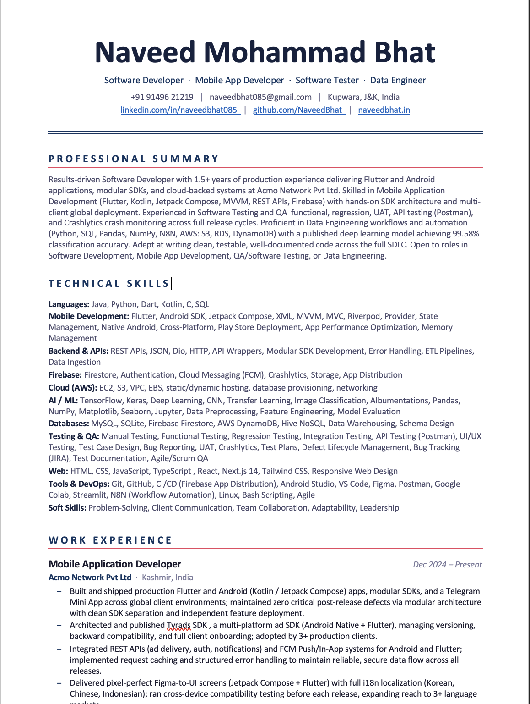
  <br/><br/>
  
</div>

---

## Key Features

- **Comprehensive Analysis** — Generates Match Score, Skill Gap Report, Keyword Density, and a 4-dimension ATS compatibility score.
- **DOCX Reconstruction** — Analyzes your resume text but rebuilds and downloads a beautifully optimized `.docx` file, preserving your original template perfectly.
- **Token Efficient** — The system intelligently filters editable vs. non-editable sections before sending them to the AI, saving up to 70% of tokens.
- **Dual-AI Redundancy** — Automatic failover from Gemini Flash to Groq when the primary AI is rate-limited or unavailable.
- **Zero Backend Required** — The frontend communicates directly with the n8n webhooks. No databases, no servers, just static files.
- **Completely Free** — Runs entirely on the free tiers of n8n Cloud (or self-hosted), Google Gemini, and Groq. Total running cost is $0.

---


## Architecture

<div align="center">

```
                     ┌──────────────────────────────┐
                     │    Frontend Application      │
                     │  (HTML / Vanilla JS / CSS)   │
                     └─────────────┬────────────────┘
                                   │  Upload Resume (.docx) & JD Text
                                   ▼
                ┌──────────────────────────────────────┐
                │          n8n Webhook Router          │
                │  /analyze  |  /optimize  |  /jobs    │
                └──────────────────┬───────────────────┘
                                   │
               ┌───────────────────▼───────────────────┐
               │         Primary AI — Gemini Flash     │
               └──────┬─────────────────────────┬──────┘
                      │ ✅ Success               │ ❌ Error or Rate Limit
                      │                          ▼
                      │            ┌─────────────────────────┐
                      │            │  Fallback AI — Groq      │
                      │            │  Llama 3 Instant         │
                      │            └──────┬───────────┬──────┘
                      │                   │ ✅         │ ❌
                      │                   │           ▼
                      │                   │  🚨 Error Handled &
                      │                   │  Returned to UI cleanly
               ┌──────▼───────────────────▼────────────┐
               │    Parse Optimizer Response (JSON)    │
               │    Validate via Section IDs           │
               └──────────────┬────────────────────────┘
                              │
             ┌────────────────▼────────────────────────┐
             │       Frontend Rebuilds DOCX            │
             │   (PizZip XML replacement in browser)   │
             └────────────────┬────────────────────────┘
                              │
                              ▼
                     📄 Download Optimized Resume
```

</div>

---

## What You Get

| Module | What it does |
|---|---|
| **Match Score** | 0–100% overall resume-to-job fit |
| **Skill Gap Report** | Matching, missing, bonus, and critical missing skills |
| **Keyword Analysis** | JD keyword density + matched/missing terms |
| **ATS Score** | 4-dimension ATS compatibility with actionable fixes |
| **Optimized Resume** | Truthful, keyword-enriched summary + improvement suggestions, delivered as a perfectly formatted `.docx` |
| **Analysis Report** | Strengths, weaknesses, quick wins, prioritized recommendations |

---

## Tech Stack

| Tool | Role | Free Tier |
|------|------|-----------|
| [n8n Cloud](https://n8n.io) | Workflow automation & API orchestration | 1,000 executions/month |
| [Google Gemini Flash](https://aistudio.google.com) | Primary LLM — deep analysis & document rewriting | 1,500 req/day |
| [Groq API](https://console.groq.com) | Fallback LLM — lightning-fast auto-failover | High limits |
| Vanilla JS / PizZip | Client-side logic and in-browser `.docx` rebuilding | Unlimited |
| Vercel/Netlify | Frontend static hosting | Unlimited |

**Total running cost: $0/month**

---

## Prerequisites

To run your own instance of JobGenieAI (v3.0), you will need:

- An [n8n Cloud](https://app.n8n.cloud) account or self-hosted n8n instance.
- A [Google Gemini API key](https://aistudio.google.com/app/apikey) (free tier).
- A [Groq API key](https://console.groq.com) (free tier).

---

## Configuration

### 1. n8n Setup
1. Import `JobGenieAI_v3.json` into your n8n workspace.
2. In the workflow, open the **Gemini** and **Groq** nodes (there are two of each).
3. Under the **Header Parameters** of each HTTP Request node, insert your API keys directly into the `Authorization` or URL parameters as required by the node configuration. *(Note: We use explicit header injection rather than the credential manager for tighter control in this build).*

### 2. Frontend Setup
1. Open `frontend/app.js`.
2. Locate the webhook URL variables (around the top of the file) and replace them with your active n8n Webhook URLs.
3. Serve the `frontend/` folder via a local server (e.g., `npx serve frontend`) or host it on Netlify/Vercel.

> **Note:** Do not open `index.html` directly via `file://` protocol in your browser, as CORS policies will prevent communication with the n8n webhooks. Always use a local server.

---

## 🚀 Usage

1. Open the JobGenieAI frontend in your browser.
2. Enter the target **Job Description**.
3. Upload your **Resume** (Must be a `.docx` file).
4. Click **"Analyze & Optimize"**.
5. Wait for the dual-AIs to process the data via n8n.
6. Review your Match Score, Skill Gaps, and ATS breakdown.
7. Download the **Optimized Resume**, neatly preserved in your original `.docx` formatting.

---

## ⚙ API Reference (n8n Webhooks)

JobGenieAI v3.0 exposes three separate webhooks. If you wish to bypass the frontend and hit the n8n workflow directly via API:

### 1. Analysis Endpoint
**POST** `/webhook/jobgenie/analyze`
```http
POST /webhook/jobgenie/analyze
Content-Type: application/json

{
  "resumeText": "John Doe\nSoftware Engineer...",
  "jobDescription": "We are looking for a Senior...",
  "resumeFileName": "john_doe_resume.docx"
}
```

**Response** (JSON)
```json
{
  "success": true,
  "requestId": "jg-1234567890-abc123",
  "data": {
    "matchScore": 78,
    "skillAnalysis": {
      "matchingSkills": ["React", "Node.js"],
      "missingSkills": ["Docker"],
      "bonusSkills": ["GraphQL"],
      "criticalMissing": ["Docker"]
    },
    "atsScore": {
      "overall": 72,
      "breakdown": { "formatting": 20, "keywords": 18, "sections": 22, "readability": 12 },
      "fixes": ["Add numbers to at least 3 bullet points"]
    },
    "analysisReport": { ... }
  }
}
```

### 2. Optimizer Endpoint
**POST** `/webhook/jobgenie/optimize`
Takes the parsed DOCX sections and rewrites them contextually based on the Job Description, preserving the original formatting layout.

### 3. Job Search Endpoint
**POST** `/webhook/jobgenie/jobs`
Takes the Job Description and queries the Jooble API to return similar live job postings.

---

## 🛡 Privacy & Security

When dealing with resumes, data privacy is paramount:

- **No Data Stored**: n8n processes the payload in memory and returns a response. Nothing is saved to a database.
- **Client-Side Rebuilding**: The actual `DOCX` file modification (XML parsing) happens entirely within your browser using PizZip. The server only sees plain text.
- **No User Accounts**: Zero authentication required, no tracking cookies.

---

## 🐛 Troubleshooting

| Problem | Solution |
|---|---|
| **"Could not reach server"** | Check if n8n is running and the webhook URLs in `app.js` are correct. |
| **"Analysis failed on all providers"** | Check that your API keys are correctly injected into the n8n Header Parameters. |
| **"PizZip is not defined"** | Ensure the CDN script tag for `pizzip` in `index.html` is not blocked. |
| **CORS errors** | Ensure you are running the frontend via a local server (e.g., `npx serve`), not `file://`. |

---


## License

This project is licensed under the [MIT License](LICENSE).

---

## Author

**Naveed Bhat**

> *"Optimizing careers through intelligent automation."*

---

<div align="center">

*JobGenieAI v3.0 — Built June 2026 | Serverless | Dual-AI Redundancy | In-Browser DOCX Engine*

</div>

---

## 📚 Additional Screenshots

<div align="center">
  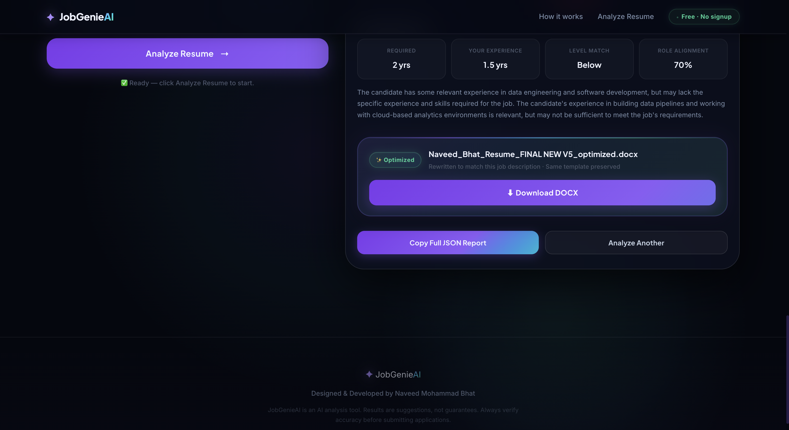
  <br/><br/>
  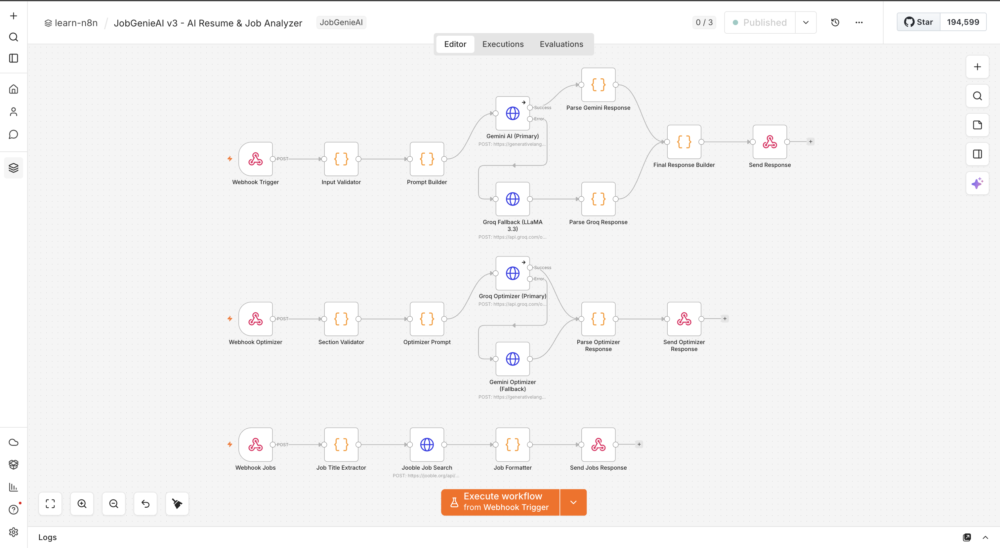
  <br/><br/>

  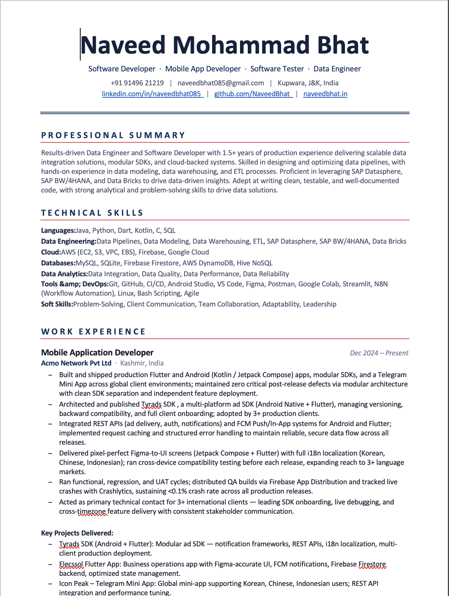
  <br/><br/>
  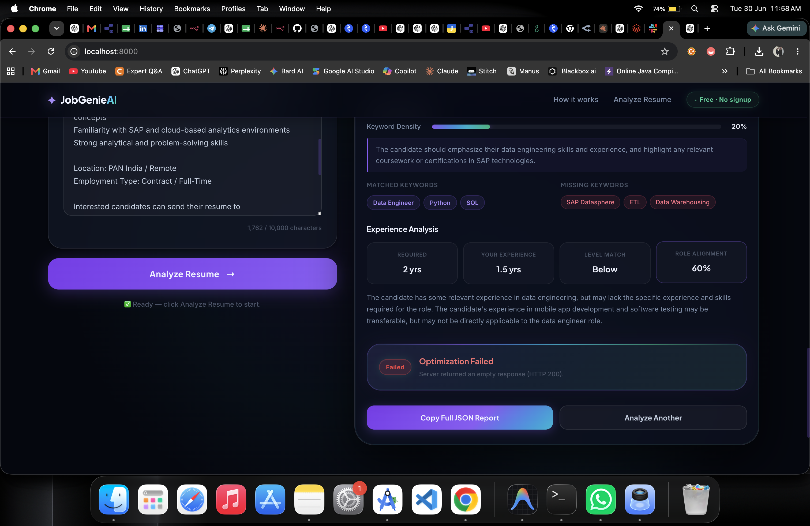
  <br/><br/>
  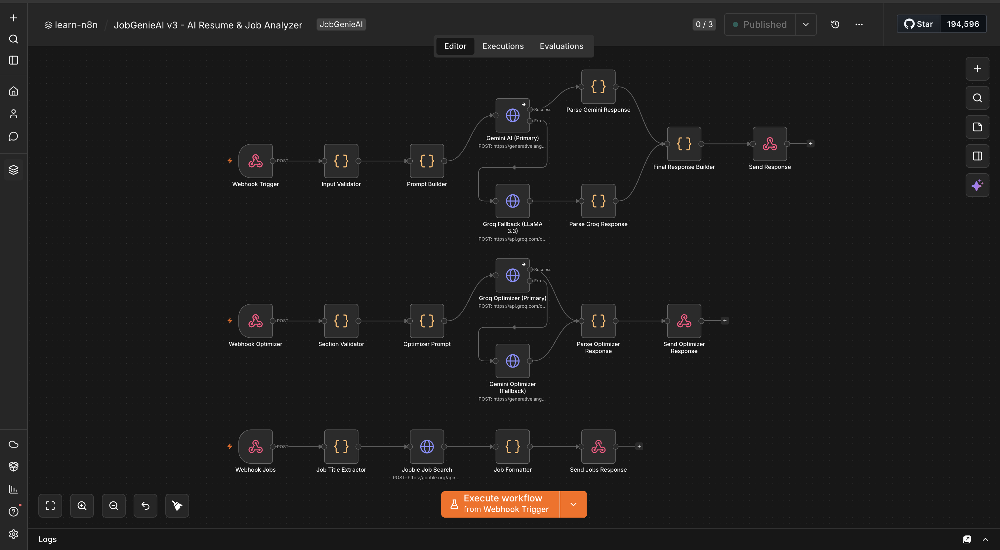
  <br/><br/>
  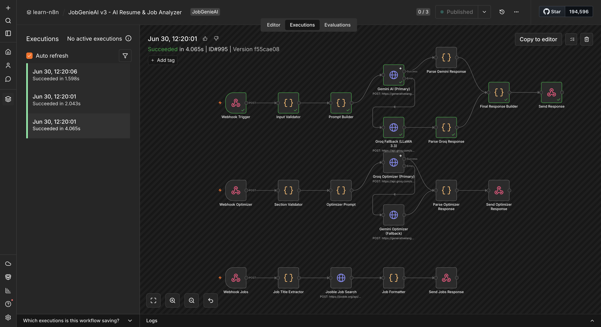
</div>
